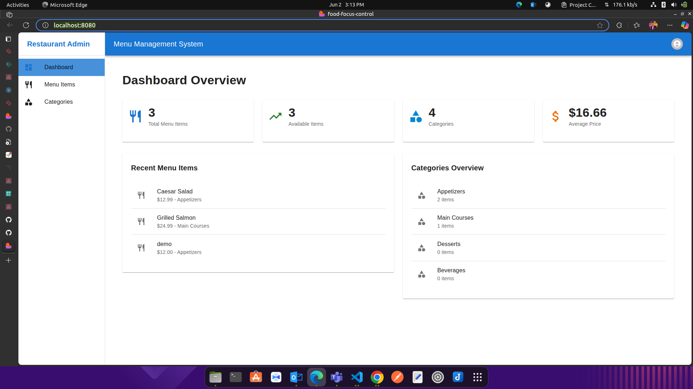
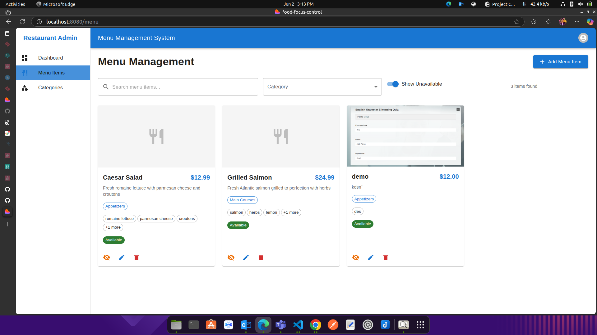
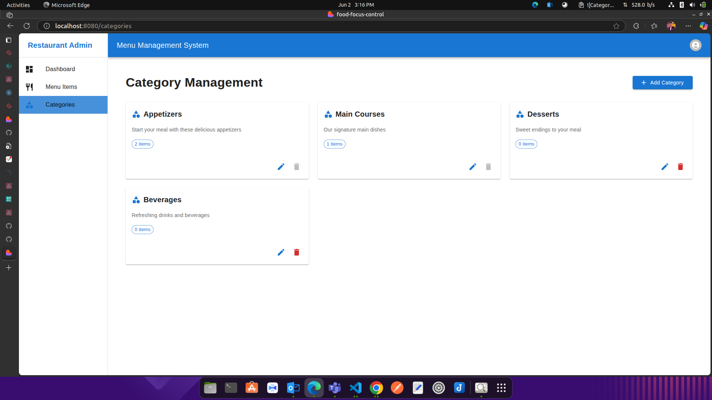

# 📖 Restaurant Admin Panel - Menu Management System

A responsive, easy-to-use **Admin Panel** for managing a restaurant's menu, built with **React**, **TypeScript**, **Redux Toolkit**, and **Material UI (MUI)**. This panel allows restaurant admins to manage menu items, categories, and monitor key metrics—all stored using `localStorage`.

## 🚀 Features

### 🔒 User Authentication

- Secure login system to ensure only authorized personnel can access the panel.

### 📋 Menu Management

- **View Menu Items:** See all menu items in a card/grid layout with categories, descriptions, and prices.
- **Add New Items:** Add new dishes with images, description, ingredients, categories, and price.
- **Edit Existing Items:** Easily modify item details.
- **Delete Items:** Remove outdated or unavailable dishes.
- **Set Availability:** Mark items as available/unavailable.
- **Categorization:** Organize dishes into categories like Appetizers, Main Courses, Desserts, and Beverages.
- **Image Uploads:** Enhance menu presentation with image uploads.

### 📊 Dashboard Overview

- **Total Menu Items:** Displays the total number of items in the menu.
- **Available Items:** Shows how many items are currently available.
- **Categories Count:** Number of categories created.
- **Average Price:** Calculates the average price of menu items.
- **Recent Menu Items:** Quick access to recently added or modified items.
- **Categories Overview:** Displays categories and the count of items in each.

### 🔍 Search and Filters

- Search bar for locating specific menu items.
- Category filters for streamlined viewing.
- Toggle to show/hide unavailable items.

### 📱 Responsive Design

- Built with **MUI**, ensuring usability across desktops, tablets, and mobile devices.

### 💾 Local Storage

- Data persistence through `localStorage`, so your menu and categories remain intact across sessions without backend integration.

### 🎨 Design

- Fully styled with **Material UI**, using MUI’s components and icons for a clean, professional look.

## 🛠️ Tech Stack

- **Frontend:** React + TypeScript
- **State Management:** Redux Toolkit
- **Design/UI:** Material UI (MUI)
- **Data Persistence:** `localStorage`

## 🔑 How to Run Locally

1. Clone the repository:

   ```bash
   git clone https://github.com/aftab-pathan-simform/React-POC
   cd your-repo-folder
   ```

2. Install dependencies:

   ```bash
   npm install
   ```

3. Start the development server:

   ```bash
   npm start
   ```

4. Open `http://localhost:8080` in your browser.

## 📝 Notes

- **Authentication is mocked.** You can enhance it by integrating real auth services (Firebase/Auth0).
- **LocalStorage is used.** For production, replace with a proper backend/API.
- **MUI Icons and Design are strictly used.** No other UI libraries included.

## 📸 Screenshots

Here are some key UI views:

- **Dashboard Overview:** Displays stats, recent menu items, and category overview.
- **Menu Items:** Card-based layout showing items with edit/delete options.
- **Categories:** List of categories with edit/delete options.




